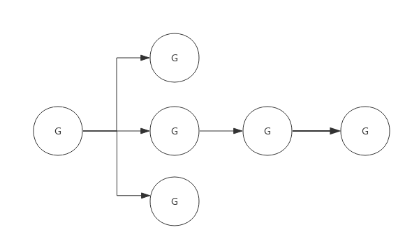

# 1. 前言
Golang context是Golang应用开发常用的并发控制技术，它与WaitGroup最大的不同点是context对于派生goroutine有更强的控制力，它可以控制多级的goroutine。

context翻译成中文是"上下文"，即它可以控制一组呈树状结构的goroutine，每个goroutine拥有相同的上下文。

典型的使用场景如下图所示：



上图中由于goroutine派生出子goroutine，而子goroutine又继续派生新的goroutine，这种情况下使用WaitGroup就不太容易，因为子goroutine个数不容易确定。而使用context就可以很容易实现。

# 2. Context实现原理
context实际上只定义了接口，凡是实现该接口的类都可称为是一种context，官方包中实现了几个常用的context，分别可用于不同的场景。

## 2.1 接口定义
源码包中`src/context/context.go:Context` 定义了该接口：
```go
type Context interface {
    Deadline() (deadline time.Time, ok bool)

    Done() <-chan struct{}

    Err() error

    Value(key interface{}) interface{}
}
```
基础的context接口只定义了4个方法，下面分别简要说明一下：
### 2.1.1 Deadline()
该方法返回一个deadline和标识是否已设置deadline的bool值，如果没有设置deadline，则ok == false，此时deadline为一个初始值的time.Time值

### 2.1.2 Done()
该方法返回一个channel，需要在select-case语句中使用，如"case <-context.Done():"。

当context关闭后，Done()返回一个被关闭的管道，关闭的管道仍然是可读的，据此goroutine可以收到关闭请求；
当context还未关闭时，Done()返回nil。

### 2.1.3 Err()
该方法描述context关闭的原因。关闭原因由context实现控制，不需要用户设置。比如Deadline context，关闭原因可能是因为deadline，也可能提前被主动关闭，那么关闭原因就会不同:
- 因deadline关闭：“context deadline exceeded”；
- 因主动关闭： "context canceled"。

当context关闭后，Err()返回context的关闭原因；
当context还未关闭时，Err()返回nil；

### 2.1.3 Value()
有一种context，它不是用于控制呈树状分布的goroutine，而是用于在树状分布的goroutine间传递信息。

Value()方法就是用于此种类型的context，该方法根据key值查询map中的value。具体使用后面示例说明。

## 2.2 空context
context包中定义了一个空的context， 名为emptyCtx，用于context的根节点，空的context只是简单的实现了Context，本身不包含任何值，仅用于其他context的父节点。

emptyCtx类型定义如下代码所示：
```go
type emptyCtx int

func (*emptyCtx) Deadline() (deadline time.Time, ok bool) {
	return
}

func (*emptyCtx) Done() <-chan struct{} {
	return nil
}

func (*emptyCtx) Err() error {
	return nil
}

func (*emptyCtx) Value(key interface{}) interface{} {
	return nil
}
```

context包中定义了一个公用的emptCtx全局变量，名为background，可以使用context.Background()获取它，实现代码如下所示：
```go
var background = new(emptyCtx)
func Background() Context {
	return background
}
```

context包提供了4个方法创建不同类型的context，使用这四个方法时如果没有父context，都需要传入backgroud，即backgroud作为其父节点：
- WithCancel()
- WithDeadline()
- WithTimeout()
- WithValue()

context包中实现Context接口的struct，除了emptyCtx外，还有cancelCtx、timerCtx和valueCtx三种，正是基于这三种context实例，实现了上述4种类型的context。

context包中各context类型之间的关系，如下图所示：


struct cancelCtx、timerCtx、valueCtx都继承于Context，下面分别介绍这三个struct。

## 2.3 cancelCtx
源码包中`src/context/context.go:cancelCtx` 定义了该类型context：
```go
type cancelCtx struct {
	Context

	mu       sync.Mutex            // protects following fields
	done     chan struct{}         // created lazily, closed by first cancel call
	children map[canceler]struct{} // set to nil by the first cancel call
	err      error                 // set to non-nil by the first cancel call
}
```
children中记录了由此context派生的所有child，此context被cancel时会把其中的所有child都cancel掉。

cancelCtx与deadline和value无关，所以只需要实现Done()和Err()外露接口即可。

### 2.3.1 Done()接口实现
按照Context定义，Done()接口只需要返回一个channel即可，对于cancelCtx来说只需要返回成员变量done即可。

这里直接看下源码，非常简单：
```go
func (c *cancelCtx) Done() <-chan struct{} {
	c.mu.Lock()
	if c.done == nil {
		c.done = make(chan struct{})
	}
	d := c.done
	c.mu.Unlock()
	return d
}
```
由于cancelCtx没有指定初始化函数，所以cancelCtx.done可能还未分配，所以需要考虑初始化。
cancelCtx.done会在context被cancel时关闭，所以cancelCtx.done的值一般经历如下三个阶段：
nil --> chan struct{} --> closed chan。

### 2.3.2 Err()接口实现
按照Context定义，Err()只需要返回一个error告知context被关闭的原因。对于cancelCtx来说只需要返回成员变量err即可。

还是直接看下源码：
```go
func (c *cancelCtx) Err() error {
	c.mu.Lock()
	err := c.err
	c.mu.Unlock()
	return err
}
```
cancelCtx.err默认是nil，在context被cancel时指定一个error变量： `var Canceled = errors.New("context canceled")`。

### 2.3.3 cancel()接口实现
cancel()内部方法是理解cancelCtx的最关键的方法，其作用是关闭自己和其后代，其后代存储在cancelCtx.children的map中，其中key值即后代对象，value值并没有意义，这里使用map只是为了方便查询而已。

cancel方法实现伪代码如下所示：
```go
func (c *cancelCtx) cancel(removeFromParent bool, err error) {
    c.mu.Lock()

    c.err = err	                      //设置一个error，说明关闭原因
    close(c.done)                     //将channel关闭，以此通知派生的context

    for child := range c.children {   //遍历所有children，逐个调用cancel方法
        child.cancel(false, err)
    }
    c.children = nil
    c.mu.Unlock()

    if removeFromParent {            //正常情况下，需要将自己从parent删除
        removeChild(c.Context, c)
    }
}
```
实际上，WithCancel()返回的第二个用于cancel context的方法正是此cancel()。

### 2.3.4 WithCancel()方法实现
WithCancel()方法作了三件事：
- 初始化一个cancelCtx实例
- 将cancelCtx实例添加到其父节点的children中(如果父节点也可以被cancel的话)
- 返回cancelCtx实例和cancel()方法

其实现源码如下所示：
```go
func WithCancel(parent Context) (ctx Context, cancel CancelFunc) {
	c := newCancelCtx(parent)
	propagateCancel(parent, &c)   //将自身添加到父节点
	return &c, func() { c.cancel(true, Canceled) }
}
```

这里将自身添加到父节点的过程有必要简单说明一下：
1. 如果父节点也支持cancel，也就是说其父节点肯定有children成员，那么把新context添加到children里即可；
2. 如果父节点不支持cancel，就继续向上查询，直到找到一个支持cancel的节点，把新context添加到children里；
3. 如果所有的父节点均不支持cancel，则启动一个协程等待父节点结束，然后再把当前context结束。


### 2.3.5 典型使用案例
一个典型的使用cancel context的例子如下所示：
```go
package main

import (
    "fmt"
    "time"
    "context"
)

func HandelRequest(ctx context.Context) {
    go WriteRedis(ctx)
    go WriteDatabase(ctx)
    for {
        select {
        case <-ctx.Done():
            fmt.Println("HandelRequest Done.")
            return
        default:
            fmt.Println("HandelRequest running")
            time.Sleep(2 * time.Second)
        }
    }
}

func WriteRedis(ctx context.Context) {
    for {
        select {
        case <-ctx.Done():
            fmt.Println("WriteRedis Done.")
            return
        default:
            fmt.Println("WriteRedis running")
            time.Sleep(2 * time.Second)
        }
    }
}

func WriteDatabase(ctx context.Context) {
    for {
        select {
        case <-ctx.Done():
            fmt.Println("WriteDatabase Done.")
            return
        default:
            fmt.Println("WriteDatabase running")
            time.Sleep(2 * time.Second)
        }
    }
}

func main() {
    ctx, cancel := context.WithCancel(context.Background())
    go HandelRequest(ctx)

    time.Sleep(5 * time.Second)
    fmt.Println("It's time to stop all sub goroutines!")
    cancel()

    //Just for test whether sub goroutines exit or not
    time.Sleep(5 * time.Second)
}

```
上面代码中协程HandelRequest()用于处理某个请求，其又会创建两个协程：WriteRedis()、WriteDatabase()，main协程创建创建context，并把context在各子协程间传递，main协程在适当的时机可以cancel掉所有子协程。

程序输出如下所示：
```go
HandelRequest running
WriteDatabase running
WriteRedis running
HandelRequest running
WriteDatabase running
WriteRedis running
HandelRequest running
WriteDatabase running
WriteRedis running
It's time to stop all sub goroutines!
WriteDatabase Done.
HandelRequest Done.
WriteRedis Done.

```

## 2.4 timerCtx
源码包中`src/context/context.go:timerCtx` 定义了该类型context：
```go
type timerCtx struct {
	cancelCtx
	timer *time.Timer // Under cancelCtx.mu.

	deadline time.Time
}
```
timerCtx在cancelCtx基础上增加了deadline用于标示自动cancel的最终时间，而timer就是一个触发自动cancel的定时器。

由此，衍生出WithDeadline()和WithTimeout()。实现上这两种类型实现原理一样，只不过使用语境不一样：
- deadline: 指定最后期限，比如context将2018.10.20 00:00:00之时自动结束
- timeout: 指定最长存活时间，比如context将在30s后结束。

对于接口来说，timerCtx在cancelCtx基础上还需要实现Deadline()和cancel()方法，其中cancel()方法是重写的。

### 2.4.1 Deadline()接口实现
Deadline()方法仅仅是返回timerCtx.deadline而矣。而timerCtx.deadline是WithDeadline()或WithTimeout()方法设置的。

### 2.4.2 cancel()接口实现
cancel()方法基本继承cancelCtx，只需要额外把timer关闭。

timerCtx被关闭后，timerCtx.cancelCtx.err将会存储关闭原因：
- 如果deadline到来之前手动关闭，则关闭原因与cancelCtx显示一致；
- 如果deadline到来时自动关闭，则原因为："context deadline exceeded"

### 2.4.3 WithDeadline()方法实现
WithDeadline()方法实现步骤如下：
- 初始化一个timerCtx实例
- 将timerCtx实例添加到其父节点的children中(如果父节点也可以被cancel的话)
- 启动定时器，定时器到期后会自动cancel本context
- 返回timerCtx实例和cancel()方法

也就是说，timerCtx类型的context不仅支持手动cancel，也会在定时器到来后自动cancel。

### 2.4.4 WithTimeout()方法实现
WithTimeout()实际调用了WithDeadline，二者实现原理一致。

看代码会非常清晰：
```go
func WithTimeout(parent Context, timeout time.Duration) (Context, CancelFunc) {
	return WithDeadline(parent, time.Now().Add(timeout))
}
```

### 2.4.5 典型使用案例
下面例子中使用WithTimeout()获得一个context并在其子协程中传递：
```go
package main

import (
    "fmt"
    "time"
    "context"
)

func HandelRequest(ctx context.Context) {
    go WriteRedis(ctx)
    go WriteDatabase(ctx)
    for {
        select {
        case <-ctx.Done():
            fmt.Println("HandelRequest Done.")
            return
        default:
            fmt.Println("HandelRequest running")
            time.Sleep(2 * time.Second)
        }
    }
}

func WriteRedis(ctx context.Context) {
    for {
        select {
        case <-ctx.Done():
            fmt.Println("WriteRedis Done.")
            return
        default:
            fmt.Println("WriteRedis running")
            time.Sleep(2 * time.Second)
        }
    }
}

func WriteDatabase(ctx context.Context) {
    for {
        select {
        case <-ctx.Done():
            fmt.Println("WriteDatabase Done.")
            return
        default:
            fmt.Println("WriteDatabase running")
            time.Sleep(2 * time.Second)
        }
    }
}

func main() {
    ctx, _ := context.WithTimeout(context.Background(), 5 * time.Second)
    go HandelRequest(ctx)

    time.Sleep(10 * time.Second)
}
```
主协程中创建一个10s超时的context，并将其传递给子协程，10s自动关闭context。程序输出如下：
```
HandelRequest running
WriteRedis running
WriteDatabase running
HandelRequest running
WriteRedis running
WriteDatabase running
HandelRequest running
WriteRedis running
WriteDatabase running
HandelRequest Done.
WriteDatabase Done.
WriteRedis Done.
```

## 2.5 valueCtx
源码包中`src/context/context.go:valueCtx` 定义了该类型context：
```go
type valueCtx struct {
	Context
	key, val interface{}
}
```
valueCtx只是在Context基础上增加了一个key-value对，用于在各级协程间传递一些数据。

由于valueCtx既不需要cancel，也不需要deadline，那么只需要实现Value()接口即可。

### 2.5.1 Value（）接口实现
由valueCtx数据结构定义可见，valueCtx.key和valueCtx.val分别代表其key和value值。 实现也很简单：
```go
func (c *valueCtx) Value(key interface{}) interface{} {
	if c.key == key {
		return c.val
	}
	return c.Context.Value(key)
}
```
这里有个细节需要关注一下，即当前context查找不到key时，会向父节点查找，如果查询不到则最终返回interface{}。也就是说，可以通过子context查询到父的value值。

### 2.5.2 WithValue（）方法实现
WithValue()实现也是非常的简单, 伪代码如下：
```go
func WithValue(parent Context, key, val interface{}) Context {
	if key == nil {
		panic("nil key")
	}
	return &valueCtx{parent, key, val}
}
```

### 2.5.3 典型使用案例
下面示例程序展示valueCtx的用法：
```go
package main

import (
    "fmt"
    "time"
    "context"
)

func HandelRequest(ctx context.Context) {
    for {
        select {
        case <-ctx.Done():
            fmt.Println("HandelRequest Done.")
            return
        default:
            fmt.Println("HandelRequest running, parameter: ", ctx.Value("parameter"))
            time.Sleep(2 * time.Second)
        }
    }
}

func main() {
    ctx := context.WithValue(context.Background(), "parameter", "1")
    go HandelRequest(ctx)

    time.Sleep(10 * time.Second)
}
```
上例main()中通过WithValue()方法获得一个context，需要指定一个父context、key和value。然后通将该context传递给子协程HandelRequest，子协程可以读取到context的key-value。

注意：本例中子协程无法自动结束，因为context是不支持cancle的，也就是说<-ctx.Done()永远无法返回。如果需要返回，需要在创建context时指定一个可以cancel的context作为父节点，使用父节点的cancel()在适当的时机结束整个context。

# 总结

- Context仅仅是一个接口定义，跟据实现的不同，可以衍生出不同的context类型；
- cancelCtx实现了Context接口，通过WithCancel()创建cancelCtx实例；
- timerCtx实现了Context接口，通过WithDeadline()和WithTimeout()创建timerCtx实例；
- valueCtx实现了Context接口，通过WithValue()创建valueCtx实例；
- 三种context实例可互为父节点，从而可以组合成不同的应用形式；
