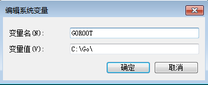
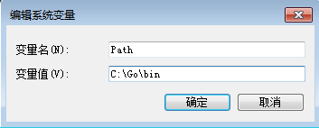
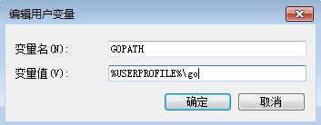

跟据我个人的经验，那些对GOPATH感到困惑的同学，往往归属于下面两类：
- 没有亲自安装过Go语言；
- 安装过，但没理解安装细节；

其实，自己亲自动手安装一遍Go语言，然后运行一个Hello World程序，就基本上能理解GOPATH。
本节主要介绍GOPATH以及与其密切相关的GOROOT，关于安装相关的详细内容不再赘述。

## GOROOT 是什么
通常我们说安装Go语言，实际上安装的是Go编译器和Go标准库，二者位于同一个安装包中。

假如你在Windows上使用Installer安装的话，它们将会被默认安装到`c:\Go`目录下，该目录即GOROOT目录，里面保存了开发GO程序所需要的所有组件，比如编译器、标准库和文档等等。

同时安装程序还会自动帮你设置GOROOT环境变量，如下图所示：

另外，安装程序还会把`c:\Go\bin`目录添加到系统的`PATH`环境变量中，如下图所示：

该目录主要是GO语言开发包中提供的二进程可执行程序。

所以，GOROOT实际上是指示GO语言安装目录的环境变量，属于GO语言顶级目录。

## GOPATH 是什么
安装完Go语言，接下来就要写自己的Hello World项目了。实际上Go语言项目是由一个或多个package组成的，这些package按照来源分为以下几种：
- 标准库
- 第三方库
- 项目私有库

其中标准库的package全部位于GOROOT环境变量指示的目录中，而第三方库和项目私有库都位于GOPATH环境变量所指示的目录中。

实际上，安装GO语言时，安装程序会设置一个默认的GOPATH环境变量，如下所示：

与GOROOT不同的是，GOPATH环境变量位于用户域，因为每个用户都可以创建自己的工作空间而互不干扰。
用户的项目需要位于`GOPATH`下的`src/`目录中。

所以GOPATH指示用户工作空间目录的环境变量，它属于用户域范畴的。

## 依赖查找
当某个package需要引用其他包时，编译器就会依次从`GOROOT/src/`和`GOPATH/src/`中去查找，如果某个包从GOROOT下找到的话，就不再到GOPATH目录下查找，所以如果项目中开发的包名与标准库相同的话，将会被自动忽略。

## GOPATH的缺点
GOPATH的优点是足够简单，但它不能很好的满足实际项目的工程需求。

比如，你有两个项目A和B，他们都引用某个第三方库T，但这两个项目使用了不同的T版本，即：
- 项目A 使用T v1.0
- 项目B 使用T v2.0

由于编译器依赖查找固定从GOPATH/src下查找`GOPATH/src/T`，所以，无法在同一个GOPATH目录下保存第三方库T的两个版本。所以项目A、B无法共享同一个GOPATH，需要各自维护一个，这给广大软件工程师带来了极大的困扰。

针对GOPATH的缺点，GO语言社区提供了Vendor机制，从此依赖管理进入第二个阶段：将项目的依赖包私有化。

> 赠人玫瑰手留余香，如果觉得不错请给个赞~
> 
> 本篇文章已归档到GitHub项目，求星~ [点我即达](https://github.com/RainbowMango/GoExpertProgramming)